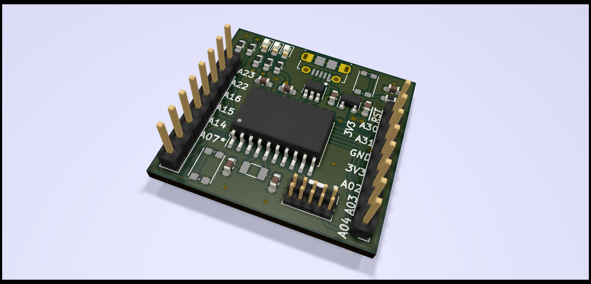

# SAMD1x-DEV

A minimal breakout board for the [Microchip (Atmel) ATSAMD11D][atsamd11] Cortex-M0+ based microcontroller. All pins are broken out to standard 2.54 mm (0.1 in) headers.

All design files and source code are under the [_Don't Be A Dick_][dbad-github] license.

## Hardware

PCBs were designed with KiCad 5; all files are provided and no custom KiCad parts are required. Most components are surface mount, with all passives being 0603 sized. Note that due to the part density, there are no reference designators on the top silkscreen.

A full bill of materials with order codes for Farnell and Mouser is included.

## Change Notes

### v0.1 -> v0.21

 - [X] Use USB-B with mounting pegs rather than pure SMD.
 - [X] Add graphical notch on programming header space.
 - [X] Choose a more widely available button (C&K KMR2).
 - [X] Increase LED limiting resistor values.
 - [X] Move LEDs off PA02 and PA04 as these are useful for ADC/DAC, now on PA14/15.
 - [X] Remove LED on PA03, just have ADC reference decoupling.
 - [X] Add power indication LED on 3V3.
 - [X] Move switch onto pin with fewer alt functions (PA16).
 - [X] Add additional switch (PA22).

[atsamd11]: https://www.microchip.com/wwwproducts/en/ATSAMD11D14
[dbad-github]: https://github.com/philsturgeon/dbad
